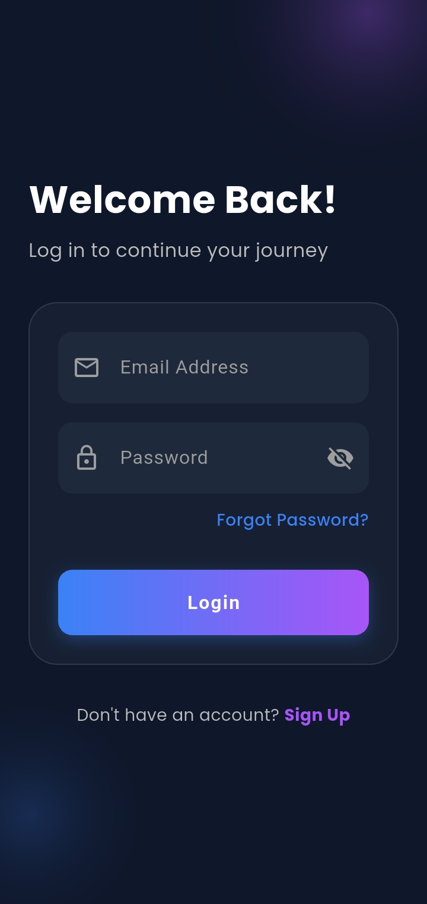
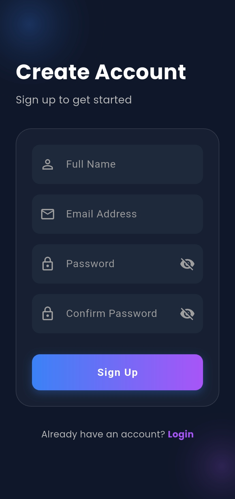
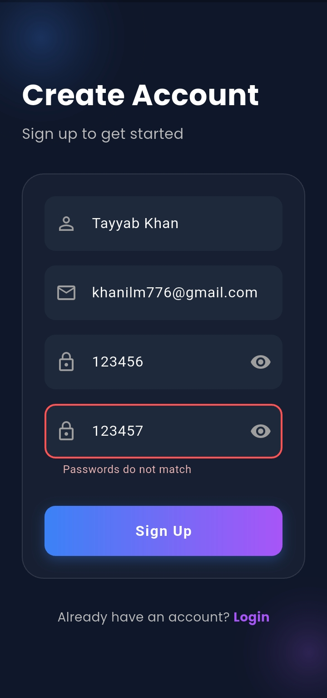
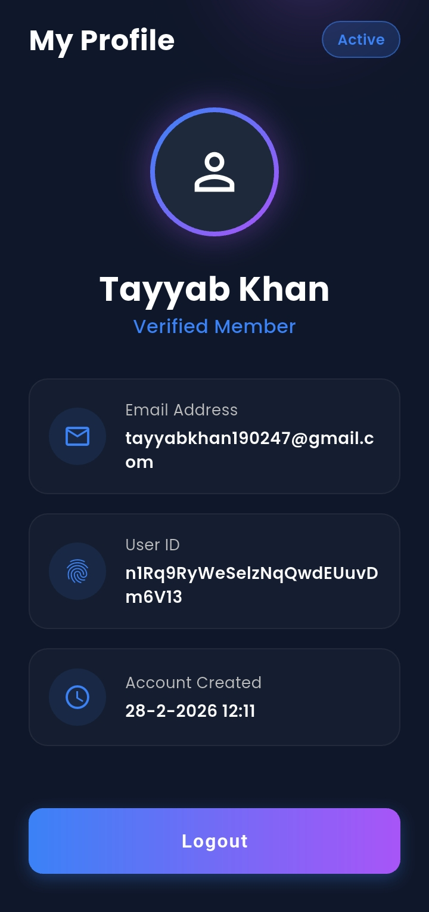
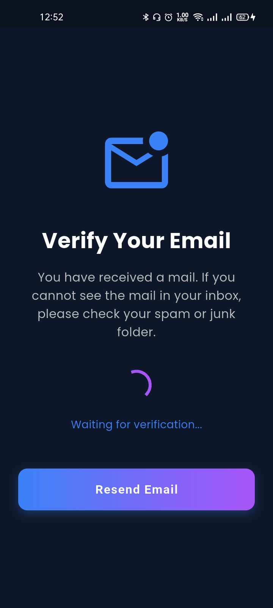

# CodeChine - Flutter Auth Task

A production-ready Flutter application built for the CodeChine internship task. It demonstrates secure Firebase Authentication, Cloud Firestore integration, session management, and Clean Architecture principles.

## 📱 App Screenshots

<p align="center">
  
  
  
  
  
  
</p>

## 🚀 Project Overview

This application provides a complete user onboarding experience. It includes user registration, login, email verification, and a user profile dashboard.

**Key Features:**
* Form validation with proper error handling.
* Firebase Authentication (Email/Password).
* Real-time user data fetching from Cloud Firestore.
* **Single-Device Session Management:** Automatically logs a user out if their account is accessed from another device.
* Custom Dark Theme UI with Google Fonts.

## 🏗️ Clean Architecture

The project follows a structured Clean Architecture approach to ensure code maintainability, scalability, and separation of concerns:

* `lib/models/`: Contains data models (e.g., `UserModel` for Firestore data).
* `lib/screens/`: Contains all UI screens (Login, Signup, Home, Verification).
* `lib/services/`: Contains backend logic and Firebase interactions (`AuthService`).
* `lib/theme/`: Contains app-wide styling, colors, and design constraints (`AppTheme`).
* `lib/widgets/`: Contains reusable UI components (`CustomButton`).

## 📦 Packages Used

* `firebase_core` - Firebase initialization
* `firebase_auth` - Secure authentication flow
* `cloud_firestore` - NoSQL database for user profiles
* `google_fonts` - Custom typography

## 🔥 Firebase Setup Steps

To run this project with your own Firebase environment:

1. Go to the [Firebase Console](https://console.firebase.google.com/) and create a new project.
2. Enable **Email/Password Authentication** in the Build > Authentication section.
3. Create a **Cloud Firestore Database** and set the security rules to allow read/write for authenticated users.
4. Run `flutterfire configure` in the terminal to automatically connect the app to your Firebase project and generate the `firebase_options.dart` file.

## 🛠️ How to Run

## 🛠️ How to Run

1. Clone this repository:
   ```bash
   git clone [https://github.com/tayyab16502/CodeChine-Intern.git](https://github.com/tayyab16502/CodeChine-Intern.git)